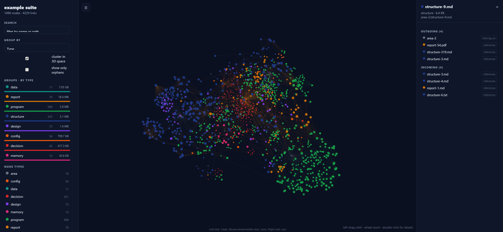
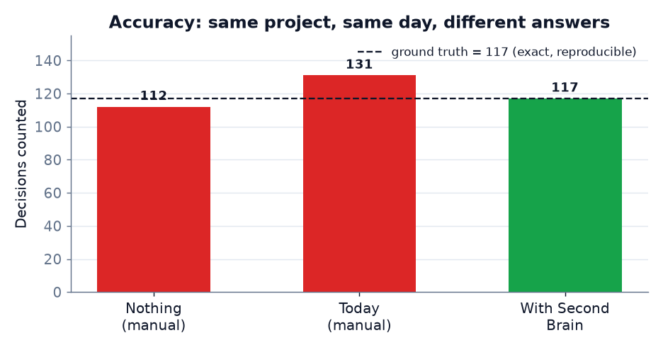
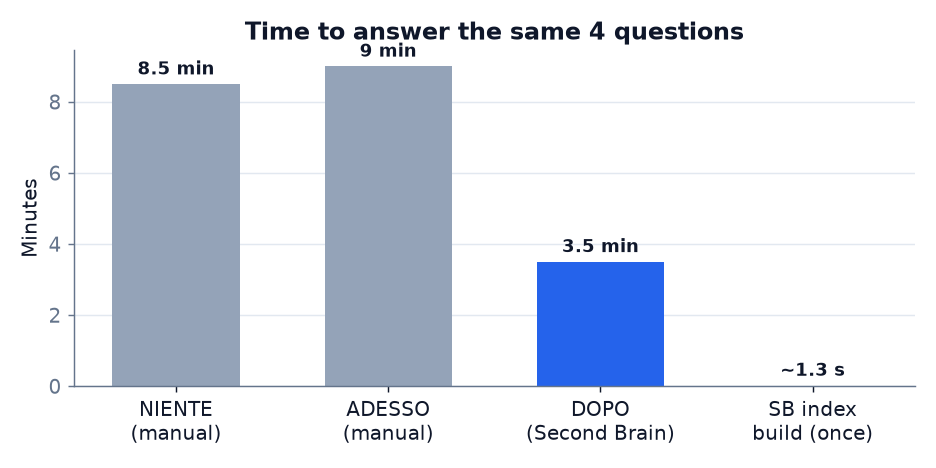
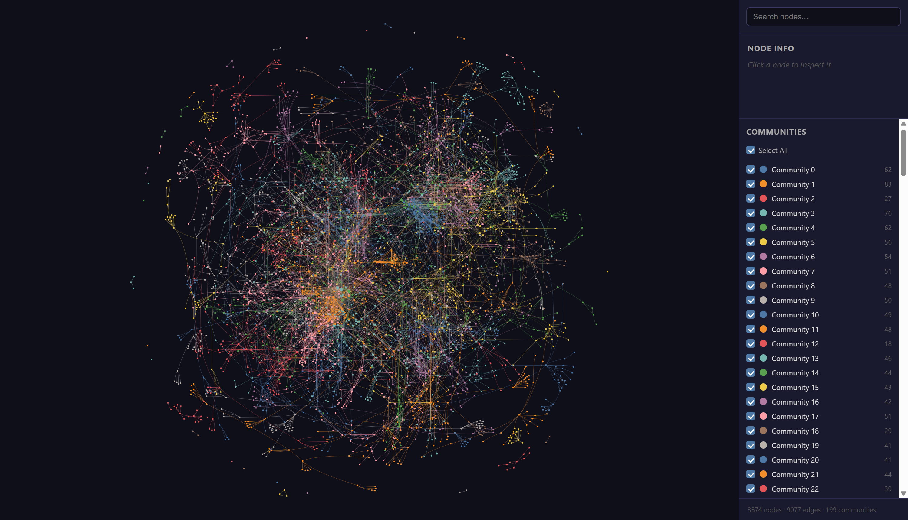

# Second Brain (SB)

[](https://github.com/lopax76/second-brain/actions/workflows/ci.yml)
[](LICENSE)
[](pyproject.toml)
[](pyproject.toml)

**Una mappa viva, sempre fresca e a basso costo di token di ogni progetto** — file, collegamenti,
aree e meccaniche — che un assistente AI può **interrogare** invece di rileggere tutto, e che una
persona può esplorare in un **grafo 3D** navigabile.

🇬🇧 [Read in English →](README.md)

> Non "un altro posto dove mettere roba". È il quadro canonico, per-progetto, che resta in sync
> con i tuoi file così non perdi mai il filo: niente pezzi dimenticati, niente "ne avevamo parlato
> tre chat fa", niente documenti stantii.



<sub>Il viewer 3D offline su un workspace multi-progetto reale (nomi anonimizzati): nodi colorati
per tipo, qui raggruppati per tipo, con pannello di dettaglio cliccabile.</sub>

---

## Perché nasce

Un progetto diventa più complesso col tempo. I file derivano, alcuni restano orfani o si rompono
in silenzio, lo schema mentale di "cosa c'è e come si collega" si fa sempre più sfocato, e un
assistente AI **perde il filo tra una chat e l'altra** — così ogni sessione riparte rileggendo e
ri-cercando i file. È lento, incompleto e **brucia token ripetutamente** — e peggiora man mano che
il progetto cresce.

Second Brain costruisce il grafo del progetto **una volta sola** e lo mantiene fresco in modo
incrementale (fuori dal modello, a costo di token quasi nullo). L'assistente lo **interroga** e
ottiene risposte compatte; una persona apre la **vista 3D** e vede l'intero progetto a colpo
d'occhio.

**Non è un sistema RAG**: niente embedding, niente vector store, nessun LLM per costruire il grafo.
Mappa le relazioni *strutturali* tra i file, il che lo rende complementare al RAG e mirato a una
cosa sola: **consapevolezza del contesto a costo di token bassissimo.**

## Cosa lo rende diverso

- **Read-only sui sorgenti** — indicizza, non modifica mai i tuoi file. Lo esegui su qualsiasi cosa
  senza rischio.
- **I file sono la verità** — il grafo è derivato (in `.secondbrain/`) e sempre rigenerabile; i
  contenuti non vengono mai duplicati dentro.
- **Zero dipendenze runtime** — il core gira con la sola libreria standard di Python. Nessun
  conflitto, installazione istantanea, funziona in CI / container / macchine air-gapped.
- **Basso costo di token per design** — le query restituiscono id, tipi, dimensioni e collegamenti,
  mai il contenuto dei file: orientare un assistente costa qualche centinaio di token, non decine di
  migliaia.
- **Gate anti-deriva** — rifiuta di dichiarare il grafo "a posto" finché c'è qualcosa di stantio,
  orfano o rotto.
- **Viewer 3D offline** — i dati sono inline e la libreria 3D è bundlata accanto alla pagina; il
  viewer funziona completamente offline, niente CDN, niente che un blocco-script possa rompere.
- **Server MCP opzionale** — espone le stesse query a basso costo agli assistenti MCP, dietro un
  extra opzionale così il core resta senza dipendenze.

## Visto su un progetto reale (anonimizzato)

Misura **read-only** su un progetto maturo multi-repo (identità non rivelata): ~1.800 file di
conoscenza in 17 aree di primo livello, indicizzato in **2,5 s** (indice `graph.json` = 0,91 MB).

Tre modi di rispondere alle stesse quattro domande sul progetto — *cosa c'è, elenca ogni decisione
registrata, quali file sono troncati/vuoti, i file più collegati* — in tre chat pulite separate:

| Metrica | NIENTE (manuale) | ADESSO (manuale) | CON Second Brain |
|---|---|---|---|
| Tempo | ~8,5 min | ~9 min | **~3–4 min** |
| Token di lavoro | opachi | opachi | **~3–4k, auto-misurabili** |
| **Decisioni trovate** | 112 (errato) | 131 (errato) | **117 (esatto)** |
| **File troncati** | 3 | 0 (mancati) | **2 (esatto)** |
| File contati | 2.174 | 2.174 | **1.684 (esatto)** |
| Riproducibile / verificabile | no | no | **sì** |

Due cose saltano all'occhio. (1) I due run manuali **non concordano tra loro** — 112 vs 131
decisioni, 3 vs 0 troncati (il secondo li ha mancati del tutto): il metodo a mano è
non-deterministico e non verificabile. (2) Second Brain dà la **risposta esatta e identica a ogni
run**, con molti meno token e in meno della metà del tempo.

Solo per *orientare* un assistente sull'intero progetto — cosa che paghi **ogni sessione** —
rileggere i documenti curati sorgente-di-verità costa **~229.000 token**; il digest
`secondbrain map` costa **~270 token**: **~800× in meno**, e ~costante mentre il progetto cresce
(l'indice completo si interroga, non entra mai nel contesto).

<p align="center">
  
  
</p>

E fa emergere ciò che persino i documenti curati non vedono: file **realmente
troncati/corrotti** (esclusi i falsi positivi UTF-16/encoding), **~45 file vuoti**, **~1.390 file
orfani (~80%)**, **117 decisioni** e **~626 riferimenti incrociati** ora espliciti e interrogabili,
più **13 file già stantii a pochi secondi** dall'indicizzazione (un sistema vivo che riscrive di
continuo) — ed è proprio per questo che la mappa deve aggiornarsi da sola.

### La stessa struttura, il layer di codice

Il layer di import-codice di Second Brain rende l'intero workspace come un grafo davvero leggibile:



## Installazione

```bash
pip install -e .            # da un clone
# una volta pubblicato:
# pip install second-brain
```

Richiede Python 3.10+. Dipendenze runtime: **nessuna** (solo libreria standard).

## Avvio rapido

```bash
secondbrain build  .          # indicizza un progetto -> .secondbrain/graph.json
secondbrain gate   .          # check anti-deriva: ref rotte, file stantii, orfani
secondbrain view   .          # scrive il viewer 3D offline -> .secondbrain/view.html
secondbrain stats  .          # conteggi rapidi per tipo nodo/arco
secondbrain map    .          # digest compatto: aree, dimensioni, file più connessi
secondbrain find   util .     # trova nodi per nome o path
secondbrain neighbors secondbrain/model.py .   # un nodo e le sue connessioni
secondbrain assess .          # report prima/dopo: problemi + risparmio token
```

**Drill-down** puntando lo strumento su una sottocartella — `secondbrain view ./src/api`
renderizza solo quell'area in pieno dettaglio, mentre la vista d'insieme resta leggera grazie alla
modalità *backbone* (aree + nucleo connesso per conoscenza; i file-dati isolati sono riassunti sul
nodo-area).

Apri `.secondbrain/view.html` in un browser (doppio clic — niente server): i dati sono inline e la
libreria 3D è bundlata accanto alla pagina, quindi **funziona completamente offline**.

## Layer di query (per gli assistenti AI)

`secondbrain map`, `find` e `neighbors` restituiscono risposte compatte e budgettate (id, tipi,
dimensioni, connessioni — mai il contenuto dei file). Un **server MCP** opzionale espone le stesse
query agli assistenti compatibili MCP:

```bash
pip install "second-brain[mcp]"
secondbrain-mcp .      # serve map / find / neighbors / subgraph / health su stdio
```

Vedi [`docs/mcp.md`](docs/mcp.md) per i tool e le forme dei dati.

## Come funziona

1. **Index** — percorre il progetto, classifica ogni file in un nodo tipizzato ed estrae gli archi:
   import Python (via `ast`), import JS/TS, riferimenti di documentazione (link markdown,
   `[[wikilink]]` e **menzioni di path in prosa** — il pezzo che gli strumenti standard mancano) e
   appartenenza ad area. Vengono aggiunti anche i nodi operativi (decisioni trovate nei documenti,
   sessioni dai commit git).
2. **Stay fresh** — il diffing per content-hash ricostruisce solo ciò che è cambiato (fuori dal
   modello).
3. **Query / view** — una persona ottiene la vista 3D; un assistente interroga il layer a basso
   costo di token.

**Sui falsi positivi:** le menzioni di path in prosa sono intrinsecamente rumorose. Second Brain
le gestisce in modo asimmetrico — link markdown e wikilink sono intenzionali (uno non risolto è
segnalato come *rotto*), ma una menzione in prosa è usata **solo se risolve** a un file reale;
altrimenti viene scartata come rumore e non crea mai un riferimento rotto. Il parsing profondo degli
import oggi è Python e JS/TS; gli altri linguaggi contribuiscono via link di documentazione.

La tassonomia completa nodi/archi, lo schema di `graph.json` e le regole di classificazione sono
documentati in [`docs/graph-format.md`](docs/graph-format.md).

## Prova tu il prima/dopo

Esegui questi in **chat pulite separate** (read-only), poi confronta le risposte e il costo
token/tempo. Sostituisci `/path/al/progetto` con un progetto reale.

**ADESSO (il tuo metodo attuale):**

```
SOLO LETTURA: non modificare, creare, cancellare o spostare alcun file. Sul progetto in
/path/al/progetto, lavora col tuo METODO NORMALE (documenti di riferimento, memoria, gli
strumenti che usi di solito). Dammi un quadro COMPLETO e ACCURATO rispondendo a 4 domande:
1) quanti file (esclusi immagini, venv, cache, .git) e ripartizione per tipo;
2) elenca TUTTE le decisioni registrate nei documenti (D-XXX, ADR-N, RFC-N);
3) quali file sono troncati/corrotti (null-byte) o vuoti (zero-byte);
4) i 10 file più collegati. Quando hai finito, dimmi tempo e token consumati.
```

**CON Second Brain** (indice già costruito — interrogalo, non rileggere i file):

```
SOLO LETTURA. L'indice di Second Brain è già costruito — va solo interrogato. Usa SOLO:
  python -m secondbrain map   "/path/al/progetto"
  python -m secondbrain stats "/path/al/progetto"
  python -m secondbrain find <testo> "/path/al/progetto"
e leggi /path/al/progetto/.secondbrain/assessment.md. Rispondi alle stesse 4 domande, poi
dimmi tempo e token consumati.
```

## Stato & roadmap

Alpha (v0.1). Funzionante oggi: grafo tipizzato, gate anti-deriva, viewer 3D offline, layer di
query a basso costo (`map`/`find`/`neighbors`/`subgraph`), nodi operativi (decisioni/sessioni) e
server MCP opzionale. Prossimi passi: risoluzione dei riferimenti più ricca e una release su PyPI.

## Sviluppo

```bash
pip install -e ".[dev,mcp]"
ruff check secondbrain tests
pytest -q
```

I contributi sono benvenuti — vedi [CONTRIBUTING.md](CONTRIBUTING.md) e i
[principi di design](CONTRIBUTING.md#design-principles-please-keep-these-intact) (read-only,
zero-deps, basso costo di token, deterministico). Segnalazioni di sicurezza: [SECURITY.md](SECURITY.md).

## Licenza

[MIT](LICENSE).
