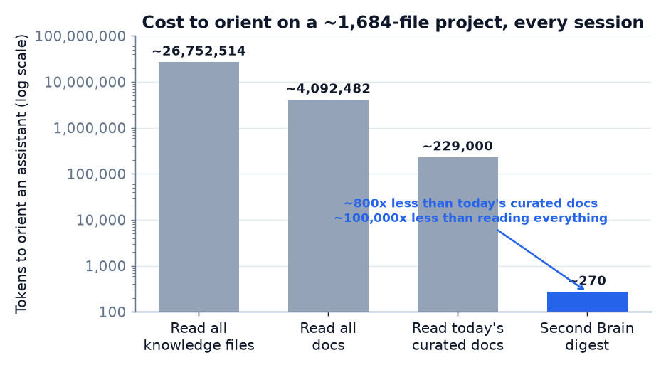
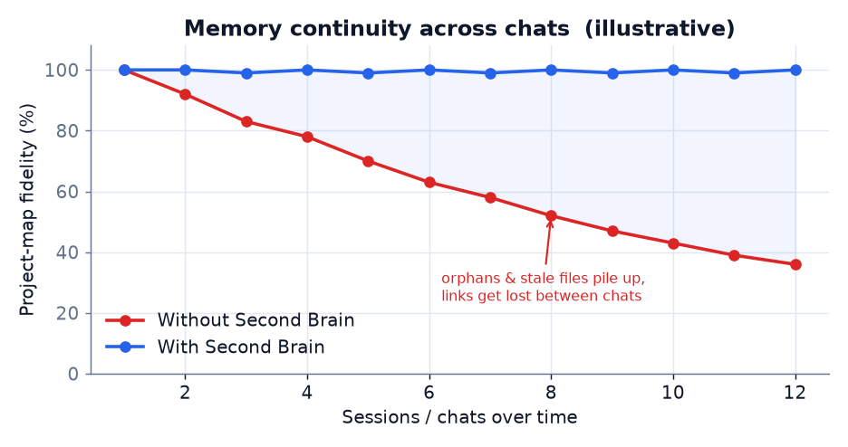

# Second Brain (SB)

[](https://github.com/lopax76/second-brain/actions/workflows/ci.yml)
[](https://pypi.org/project/second-brain-graph/)
[](LICENSE)
[](pyproject.toml)
[](pyproject.toml)

**A living, always-fresh, low-token map of every project** — files, links, areas and
mechanics — that an AI assistant can **query** instead of re-reading everything, and that a
human can explore as a navigable **2D community map**.

🇮🇹 [Leggi in italiano →](README.it.md)

> Not "another place to store stuff". It's the canonical, per-project picture that stays in
> sync with your files so you never lose track: no forgotten pieces, no "we discussed that
> three chats ago", no stale docs.


<sub>The offline viewer on a real, multi-project workspace (names anonymized): a flat 2D map with
files coloured and clustered into auto-detected communities, and a click-through detail panel.</sub>

---

## Why this exists

A project gets more complex over time. Files drift, some go orphaned or quietly broken, the
mental model of "what's where and how it connects" gets fuzzier, and an AI assistant **loses
the thread between one chat and the next** — so every session starts by re-reading and
re-searching files. That is slow, incomplete, and **burns tokens repeatedly** — and it only
gets worse as the project grows.

Second Brain builds the project's graph and keeps it honest as the project changes — a
content-hash **gate** flags exactly what drifted, and a rebuild is a fast full re-walk (outside
the model, at near-zero token cost). The assistant **queries** it and gets compact answers; a
human opens the **2D community map** and sees the whole project at a glance.

It is **not a RAG system**: no embeddings, no vector store, no LLM needed to build the graph.
It maps the *structural* relationships between files, which makes it complementary to RAG and
purpose-built for one thing: **situational awareness at a very low token cost.**

## What makes it different

- **Read-only on your sources** — it indexes, it never modifies your files. Run it on anything
  without risk.
- **Files are the truth** — the graph is derived (in `.secondbrain/`) and always regenerable;
  contents are never duplicated into it.
- **Zero runtime dependencies** — the core runs on the Python standard library alone. No
  conflicts, instant install, works in CI / containers / air-gapped boxes.
- **Low token cost by design** — queries return ids, types, sizes and connections, never file
  contents, so orienting an assistant costs a few hundred tokens, not tens of thousands.
- **Anti-drift gate** — refuses to call the graph "fine" while something is stale, orphaned, or
  broken.
- **Communities & impact** — auto-detects the project's real modules from how files link (not
  folders), and answers "what breaks if I change this?" (upstream/downstream impact) in one call.
- **`GRAPH_REPORT.md` one-pager** — the artifact an agent reads first instead of grepping: god
  nodes, communities, surprising links, decisions, and problems, regenerated on every build.
- **Offline graph viewer** — an interactive force-directed map (vis-network), coloured by
  community, with search, a click-to-inspect node panel with neighbour navigation, and a
  per-community show/hide legend. Data and library are inlined in one HTML file, so it works fully
  offline. The viewer is **adapted from [Graphify](https://github.com/safishamsi/graphify)** (MIT)
  — see [References & sources](#references--sources).
- **Importance ranking (PageRank)** — "god nodes" are ranked by *structural importance* (the files
  the important files depend on), not raw link count — a pure-Python, deterministic implementation.
- **Task-aware retrieval (`focus`)** — give it a task and it returns the *minimal high-value
  subgraph* for that task within a token budget (personalised PageRank seeded on matching files),
  instead of the whole digest.
- **Self-refreshing reads** — every query checks a cheap size+mtime signature and rebuilds only
  when the project actually changed (uncommitted edits included), so an assistant is never served a
  stale map — with no scheduler and no dependencies.
- **Opt-in symbol call-graph** — `build --symbols` adds function/class nodes and intra-file `calls`
  edges for Python (conservative resolution, no guessed edges); off by default to keep the map light.
- **GraphML export** — `export --format graphml` opens the graph in Gephi / yEd / Cytoscape / networkx.
- **Optional MCP server** — exposes the same low-token queries to MCP-aware assistants, behind
  an optional extra so the core stays dependency-free.

## See it on a real project (anonymized)

A **read-only** measurement on a mature, multi-repo project (identity withheld): ~1,684
knowledge files across 17 top-level areas, indexed in **~1.3 s** (index `graph.json` = 0.91 MB).

Three ways to answer the same four questions about the project — *what's here, list every
recorded decision, which files are truncated/empty, the most-connected files* — in three
separate clean chats:

| Metric | NOTHING (manual) | TODAY (manual) | WITH Second Brain |
|---|---|---|---|
| Time | ~8.5 min | ~9 min | **~3–4 min** |
| Working tokens | opaque | opaque | **~3–4k, self-measured** |
| **Decisions found** | 112 | 131 | **112 (exact, every run)** |
| **Truncated files** | 3 | 0 (missed) | **2 (exact)** |
| Files counted | 2,174 | 2,174 | **1,684 (exact)** |
| Reproducible / verifiable | no | no | **yes** |

Two things stand out. (1) The two manual runs **disagree with each other** — 112 vs 131
decisions, 3 vs 0 truncated files (the second missed them entirely) — so the by-hand method is
non-deterministic and unverifiable: you can't tell the right answer (112) from a wrong one
(131). (2) Second Brain returns the **same answer every run** — 112, the correct count — with
far fewer tokens and in less than half the time. The win isn't a number nobody else could
reach; it's an exact, reproducible, queryable one instead of a coin-flip.

Just to *orient* an assistant on the whole project — something you pay for **every session** —
reading the curated source-of-truth docs costs **~229,000 tokens**; the `second-brain map`
digest costs **~270 tokens**: **~800× less**, and roughly constant as the project grows (the
full index is queried, never loaded into context).

<p align="center">
  
</p>

<p align="center">
  
  
</p>

And it surfaces what even curated docs miss: genuinely **truncated/corrupted files** (with
UTF-16/encoding false positives excluded), **~45 empty files**, **~1,390 orphan files (~80%)**,
**112 decisions** and **~626 cross-references** now explicit and queryable, plus **13 files
already stale within seconds** of indexing (a live system constantly writing) — which is
exactly why the map has to update itself.

<p align="center">
  
</p>

<sub>Illustrative — the continuity problem SB removes: over many sessions a hand-kept map
drifts as orphans and stale files pile up, while a queryable graph stays current.</sub>

### The same structure, the code layer

Second Brain's code-import layer renders the whole workspace as a graph you can actually read:


## Install

```bash
pip install second-brain-graph              # from PyPI
pip install "second-brain-graph[mcp]"       # + optional MCP server
pip install -e .                            # or from a clone
```

[On PyPI](https://pypi.org/project/second-brain-graph/). Requires Python 3.10+. Runtime
dependencies: **none** (standard library only). The package installs the `second-brain` command
and the `second_brain` import module.

## Commands

Every command takes an optional project path (default `.`). **Queries are self-refreshing** — they
auto-build on first use and rebuild only when the project actually changed — so an assistant never
answers from a stale map (see *Always fresh* below).

**Build & freshness**
```bash
second-brain build .              # index the project -> .secondbrain/ (graph + GRAPH_REPORT.md)
second-brain build . --symbols    # also index the Python symbol layer (functions/classes + calls)
second-brain gate .               # anti-drift check: broken refs, stale files, orphans (exit≠0 if drifted)
```

**Orient — read these first**
```bash
second-brain report .   # GRAPH_REPORT.md: god nodes (PageRank), communities, churn, decisions, problems
second-brain communities .   # the project's real modules (clusters from imports+refs) + cross-module bridges
second-brain map .      # compact digest: areas, sizes, most-connected files
second-brain assess .   # before/after: problems + token savings
second-brain stats .    # quick counts by node/edge type
```

**Query**
```bash
second-brain find util .                            # nodes whose name/path matches "util"
second-brain neighbors second_brain/model.py .      # a node and its connections
second-brain impact second_brain/model.py .         # blast radius: what breaks / what it depends on
second-brain impact second_brain/model.py . --up    # only what depends on it (run before editing!)
second-brain impact --diff . --up                    # blast radius of your UNCOMMITTED changes (git diff)
second-brain why second_brain/cli.py second_brain/model.py .   # shortest path: how are two nodes linked?
second-brain focus "token budget in the report" .   # task-aware: the minimal high-value subgraph
second-brain focus "auth flow" . --budget 4000      #   ...within ~4000 tokens (default 2000)
second-brain symbols second_brain/model.py .        # function/class signatures of one Python file
```

**View & export**
```bash
second-brain view .             # offline 2D community-map viewer -> .secondbrain/view.html
second-brain view ./src/api     # drill into one area in full detail (top-level view stays light)
second-brain export . --format graphml --out graph.graphml   # GraphML for Gephi/yEd/Cytoscape/networkx
```

**Agent integration & automatic freshness**
```bash
second-brain agent install .    # add the SB directive to CLAUDE.md/AGENTS.md + a Claude Code hook
second-brain hook install .     # git post-commit/post-checkout: rebuild the graph on every commit
```

**Drill down** by pointing any command at a subfolder — `second-brain map ./src/api` works on just
that area; the top-level view stays light via *backbone* mode (areas + the knowledge-connected core;
isolated data files are summarized on their area node).

### Per-project tuning (`.secondbrain.json`)

Drop a `.secondbrain.json` at the project root to extend the classification taxonomy or pin a
specific file's node type when the heuristic guesses wrong (fail-safe: unknown type names are
ignored, and with no file behaviour is byte-identical):

```json
{ "classify": { "type_overrides": { "data/seed.json": "data", "notes/SPEC.md": "design" } } }
```

### Always fresh (auto-refresh)

Queries (`map` / `find` / `neighbors` / `impact` / `focus` / `report`, and the MCP tools) check a
cheap size+mtime signature before answering and **rebuild only if the project changed** — including
*uncommitted* edits. So the map is current whenever the assistant uses it, with **no scheduler and no
dependencies**. First use of a project auto-builds. To serve the stored graph as-is (skip the
check), set `SECOND_BRAIN_AUTO_REFRESH=0`. On a huge single-graph project you can throttle the
check with `SECOND_BRAIN_REFRESH_TTL=<seconds>`. The stat-only check has one narrow blind spot — a
same-size edit within the same filesystem tick as the last build — which `second-brain gate`
(content-hash) catches exactly.

| Switch | Effect |
|--------|--------|
| `SECOND_BRAIN_AUTO_REFRESH=0` | turn auto-refresh off (serve the stored graph, faster, may be stale) |
| `SECOND_BRAIN_REFRESH_TTL=<sec>` | throttle the freshness check to once per window (huge monorepo graphs) |
| `build --symbols` | include the function/class + call layer (off by default to keep the map light) |
| `focus … --budget N` | size the task-context returned by `focus` (default 2000 tokens) |
| `impact … --up` / `--down` / `--depth N` | restrict/limit the blast-radius walk |
| `view --backbone` | force backbone rendering on any size (auto above ~8000 nodes) |

### Viewing the graph

1. **Generate the viewer:** `second-brain view .`
2. **Open it:** double-click the file it writes — `.secondbrain/view.html` — in any browser. No
   server, no install: the data and the rendering library are inlined into the single page, so it
   works fully offline.
3. **Explore:** the graph is laid out as a flat **2D map**, with files coloured and clustered into
   **communities** (auto-detected from how they link). Scroll to zoom, right-drag to pan,
   double-click a node for its details (including its impact radius). Use the left panel to search,
   switch grouping (community / area / folder / type), focus a single community, or show only
   orphans.

## Query layer (for AI assistants)

`second-brain map`, `find`, `neighbors`, `impact`, `why`, `focus`, and `report` return compact,
budgeted answers (ids, types, sizes, connections — never file contents). An optional **MCP server**
exposes the same queries to MCP-aware assistants:

```bash
pip install "second-brain-graph[mcp]"
second-brain-mcp .   # project_map / find / neighbors / subgraph / impact / impact_diff / why / communities / focus / report / health
```

See [`docs/mcp.md`](docs/mcp.md) for the tools and their shapes.

## How it works

1. **Index** — walk the project, classify each file into a typed node, and extract edges:
   Python imports (via `ast`), JS/TS imports, documentation references (markdown links,
   `[[wikilinks]]`, and **plain path mentions in prose** — the part standard tools miss), and
   area membership. Operational nodes (decisions found in the docs, sessions from git commits)
   are added too.
2. **Stay fresh** — content-hash diffing tells the **gate** exactly what changed since the last
   build; a rebuild is a fast full re-walk (outside the model). Queries also **self-refresh**:
   they rebuild automatically when the project changed (uncommitted edits included), so an
   assistant never works from a stale map.
3. **Query / view** — a human gets the 2D community map; an assistant queries the low-token layer,
   and asks `focus "<task>"` for just the slice that matters for the work at hand.

**On false positives:** plain path mentions in prose are inherently noisy. Second Brain handles
this asymmetrically — markdown links and wikilinks are intentional (an unresolved one is
reported as *broken*), but a plain prose mention is used **only if it resolves** to a real file;
otherwise it is dropped as noise and never creates a broken reference. Deep import parsing is
Python and JS/TS today; other languages contribute via documentation links.

The full node/edge taxonomy, the `graph.json` schema, and the classification rules are
documented in [`docs/graph-format.md`](docs/graph-format.md).

## Try the before/after yourself

Run these in **separate clean chats** (read-only), then compare the answers and the token/time
cost. Replace `/path/to/project` with a real project.

**TODAY (your current method):**

```
READ-ONLY: do not modify, create, delete or move any file. On the project at
/path/to/project, work with your NORMAL method (reference docs, memory, the tools you
usually use). Give me a COMPLETE, ACCURATE picture answering these 4 questions:
1) how many files (excluding images, venvs, caches, .git) and the breakdown by type;
2) list ALL decisions recorded in the docs (D-XXX, ADR-N, RFC-N);
3) which files are truncated/corrupted (null-byte) or empty (zero-byte);
4) the 10 most-connected files. When done, tell me the time and tokens you used.
```

**WITH Second Brain** (index already built — query it, don't re-read files):

```
READ-ONLY. Second Brain's index is already built — only query it. Use ONLY:
  python -m second_brain map   "/path/to/project"
  python -m second_brain stats "/path/to/project"
  python -m second_brain find <text> "/path/to/project"
and read /path/to/project/.secondbrain/assessment.md. Answer the same 4 questions, then
tell me the time and tokens you used.
```

## Architecture & modules

Read-only on your sources, zero runtime dependencies, deterministic. Everything lives in the
`second_brain/` package — every public module and what it does:

| Module | Responsibility |
|--------|----------------|
| [`cli.py`](second_brain/cli.py) | Command-line interface — every `second-brain` command. |
| [`mcp_server.py`](second_brain/mcp_server.py) | Optional MCP server: the low-token query tools over stdio (extra `[mcp]`). |
| [`model.py`](second_brain/model.py) | Graph data model: typed nodes/edges, colours, the JSON-serializable container + adjacency index. |
| [`indexer.py`](second_brain/indexer.py) | Builds the graph: file nodes, areas, import/reference edges, the opt-in symbol layer. |
| [`classify.py`](second_brain/classify.py) | Classifies each file into a typed node (heuristic, configurable per project). |
| [`config.py`](second_brain/config.py) | Per-project `.secondbrain.json` config (extend/replace the classification taxonomy + per-file `type_overrides`). |
| [`ignore.py`](second_brain/ignore.py) | `.secondbrainignore` patterns + sensible default ignores. |
| [`references.py`](second_brain/references.py) | Extracts doc references: markdown links, `[[wikilinks]]`, and plain path-in-prose. |
| [`pycode.py`](second_brain/pycode.py) | Import edges: Python via `ast`, JS/TS best-effort (comments stripped). |
| [`pysymbols.py`](second_brain/pysymbols.py) | Same-file Python call graph (functions/classes + conservative `calls`). |
| [`symbols.py`](second_brain/symbols.py) | Function/class signatures of a single Python file (the `symbols` command). |
| [`freshness.py`](second_brain/freshness.py) | Content-hash manifest, cheap signature, and self-refreshing reads. |
| [`gate.py`](second_brain/gate.py) | The anti-drift gate: broken refs / stale files / orphans. |
| [`store.py`](second_brain/store.py) | Persists the derived store under `.secondbrain/` (graph, manifest, signature, mode). |
| [`query.py`](second_brain/query.py) | Low-token query layer: `map` / `find` / `neighbors` / `subgraph` / `impact` / `focus`. |
| [`bm25.py`](second_brain/bm25.py) | Okapi BM25 lexical relevance (stdlib) — the task-to-file signal that seeds `focus`. |
| [`budget.py`](second_brain/budget.py) | Token-cost estimate + budget-fit (stdlib) — the one place `focus` / `impact` count tokens. |
| [`rank.py`](second_brain/rank.py) | PageRank importance (global + personalised) — engine behind god-nodes and `focus`. |
| [`communities.py`](second_brain/communities.py) | Community detection (deterministic label propagation) + surprising cross-community edges. |
| [`operational.py`](second_brain/operational.py) | Operational nodes: decisions found in docs, sessions from git commits. |
| [`report.py`](second_brain/report.py) | Generates `GRAPH_REPORT.md` (god nodes, communities, churn, decisions, problems). |
| [`assess.py`](second_brain/assess.py) | One-shot before/after assessment: hidden problems + token savings. |
| [`viewer.py`](second_brain/viewer.py) | Offline 2D community-map viewer (vis-network, adapted from Graphify). |
| [`export.py`](second_brain/export.py) | Exports the graph to GraphML. |
| [`agent_integration.py`](second_brain/agent_integration.py) | Wires SB into AI agents: CLAUDE.md/AGENTS.md directive, Claude Code hook, git hooks. |

Reference docs: the [`graph.json` schema & taxonomy](docs/graph-format.md) and the
[MCP tools](docs/mcp.md).

## Status & roadmap

Beta — **v0.8.0**. Working today: the typed graph; the anti-drift **gate**; **self-refreshing
reads** (queries rebuild only when the project changed, no scheduler); the offline **2D
community-map** viewer; the low-token query layer (`map` / `find` / `neighbors` / `subgraph` /
`impact` — **plus `--diff` for the blast radius of your uncommitted changes** — / **`why`**
(shortest path between two nodes) / **`focus`** / **`communities`** — the project's real modules + cross-module bridges); **PageRank** importance ranking; **community
detection**; the **`GRAPH_REPORT.md`** one-pager; operational nodes (decisions/sessions); the opt-in
**Python symbol call-graph** (`build --symbols`); **GraphML export**; configurable
`.secondbrain.json` taxonomy **with per-file `type_overrides`**; **agent integration** (`agent install` + git `hook install`); and the
optional **MCP server**. Next: a truly incremental build for very large graphs, richer
reference-resolution, symbol layers for more languages, and an optional local semantic layer.

## Development

```bash
pip install -e ".[dev,mcp]"
ruff check second_brain tests
pytest -q
```

Contributions are welcome — see [CONTRIBUTING.md](CONTRIBUTING.md) and the
[design principles](CONTRIBUTING.md#design-principles-please-keep-these-intact) (read-only,
zero-deps, low-token, deterministic). Security reports: [SECURITY.md](SECURITY.md).

## References & sources

**Built on / adapted from**

- **[Graphify](https://github.com/safishamsi/graphify)** by Safi Shamsi (MIT) — the interactive
  graph viewer is modelled on Graphify's viewer; with thanks.
- **[vis-network](https://github.com/visjs/vis-network)** (Apache-2.0 OR MIT) — the rendering
  library, bundled offline. Full license texts in [THIRD_PARTY_NOTICES.md](THIRD_PARTY_NOTICES.md).

**Concepts & specifications**

- **BM25 (lexical relevance)** — S. Robertson & H. Zaragoza, *The Probabilistic Relevance Framework: BM25 and Beyond* (2009); see [Okapi BM25](https://en.wikipedia.org/wiki/Okapi_BM25). Ranks the anchor files of a task for `focus`.
- **Repo map design** — the PageRank-ranked, token-budgeted, signature-bearing map is inspired by [aider's repo map](https://aider.chat/docs/repomap.html) and the sibling project [veridge](https://github.com/galimar/veridge).
- **PageRank** — S. Brin & L. Page, *The Anatomy of a Large-Scale Hypertextual Web Search Engine*
  (1998); see [PageRank](https://en.wikipedia.org/wiki/PageRank). Used for importance ranking and
  task-aware `focus` (personalised PageRank).
- **Label propagation** — Raghavan, Albert & Kumara, *Near linear time algorithm to detect community
  structures* (2007); see [Label propagation](https://en.wikipedia.org/wiki/Label_propagation_algorithm).
  Used for deterministic community detection.
- **Model Context Protocol** — [modelcontextprotocol.io](https://modelcontextprotocol.io); the MCP
  server speaks it.
- **GraphML** — [graphml.graphdrawing.org](http://graphml.graphdrawing.org); the `export` format.
- **Python `ast`** — [docs.python.org/3/library/ast](https://docs.python.org/3/library/ast.html);
  precise Python import + symbol parsing.
- **BLAKE2** — [blake2.net](https://www.blake2.net); the stdlib content hash used for freshness.
- **Keep a Changelog** — [keepachangelog.com](https://keepachangelog.com) ·
  **Semantic Versioning** — [semver.org](https://semver.org).

**Project docs**

- [`docs/graph-format.md`](docs/graph-format.md) — on-di